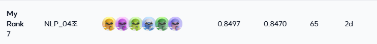

# NLP 프로젝트 : Topic Classfication

</div>

## **개요**

> 진행 기간: 24년 9월 10일 ~ 24년 9월 26일

> 데이터셋:
>
> - 학습 데이터셋 2,800개
> - 평가 데이터는 30,000개
>
> 평가 데이터의 50%는 Public 점수 계산에 활용되어 실시간 리더보드에 표기가 되고, 남은 50%는 Private 결과 계산에 활용되었습니다.

본 프로젝트는 KLUE-topic Classfication benchmark 데이터를 사용하며, 뉴스의 헤드라인을 통해 그 뉴스가 어떤 topic을 갖는지 분류해내는 Task입니다.
랜덤으로 Noise가 추가된 1600개 데이터와 라벨링 오류가 추가된 1000개가 있으며, Data-Centric 관점에서 적절한 방법을 통해 성능 향상을 이끌어내는 것이 목적입니다.

## **Contributors**

<table align='center'>
  <tr>
    <td align="center">
      <br>
      <a href="https://github.com/yeseoLee">
        
      </a>  
    </td>
    <td align="center">
      <br>
      <a href="https://github.com/Sujinkim-625">
        
      </a>  
    </td>
    <td align="center">
      <br>
      <a href="https://github.com/luckyvickyricky">
        
      </a>
    </td>
    <td align="center">
      <br>
      <a href="https://github.com/koreannn">
        
      </a>
    </td>
    <td align="center">
      <br>
      <a href="https://github.com/Effyee">
        
      </a>
    </td>
    <td align="center">
      <br>
      <a href="https://github.com/hsmin9809">
        
      </a> 
    </td>
  </tr>
</table>

## 역할

| 이름   | 역할                                                                                                                               |
| ------ | ---------------------------------------------------------------------------------------------------------------------------------- |
| 김민서 | 허깅페이스 세팅, EDA(ASCII Code 기반 분석), Data Cleaning(LLM prompting), Data Relabeling(BERT), 데이터증강(sentence mix)          |
| 김수진 | EDA(특수문자 비율 기반 분석), Data Cleaning(특수문자 제거, LLM prompting), Data Relabeling(Cleanlab), 데이터증강(Back Translation) |
| 양가연 | streamlit 개발, Data Cleaning(Tokenizer, 형태소 분석기, LLM prompting), Data Relabeling(Cleanlab)                                  |
| 이예서 | EDA(데이터 패턴분석), Data Cleaning(BART, LLM prompting), 데이터증강(LLM), 구글드라이브 데이터 백업 세팅, 프로젝트 템플릿 세팅    |
| 홍성민 | 베이스라인 리팩토링, Data Cleaning(LLM prompting), Data Relabeling(LLM), 데이터증강(LLM)                                           |
| 홍성재 | streamlit 개발, 데이터 시각화, EDA, Data Cleaning(LLM prompting)                                                                   |

## **데이터구조**

```bash
level2-nlp-datacentric-nlp-04
├── code
│   ├── main.py
│   ├── sp_denoise.py
│   ├── tokenized_denoise.py
│   ├── clean_lab
│   │   ├── class_relabel.py
│   │   └── noise_relabel.py
│   ├── utils
│   │   ├── __init__.py
│   │   ├── gdrive_manager.py
│   │   ├── upload_dataset_hf.py
│   │   └── utils.py
│   ├── pororo
│   │   ├── pororo.py
│   │   └── readme.md
│   └── LLM
│       ├── augmentation_synonyms.py
│       ├── augmentation.py
│       ├── denoise.py
│       ├── model.py
│       ├── processing.py
│       └── prompt
│           ├── __init__.py
│           ├── agument.py
│           ├── denoise.py
│           └── relabel.py
├── config
│   └── config-sample.yaml
├── notebooks
│       ├── denoising.ipynb
│       ├── noise_detect_eda.ipynb
│       └── noise_eda_using_special_char.ipynb
├── preprocess_minseo
│   ├── check-gpu.cmd
│   ├── csv_updater.py
│   ├── 0.rule-based-noise_detect
│   │   ├── minseo_eda.ipynb
│   │   └── minseo_noise_detect_byascii.ipynb
│   ├── 1.BERT-based-relabeling
│   │   ├── compare_label_changes.py
│   │   ├── fix-label-encoder-model.py
│   │   ├── label_fix.py
│   │   ├── separate_train_test_by_noise.py
│   │   └── config.yaml
│   ├── 2.LLM-based-denoising
│   │   ├── change_train_file.py
│   │   ├── LLM-based-text-denoising.py
│   │   ├── config.yaml
│   │   └── result_eda.ipynb
│   └── 4.mix-same-label
│       ├── csv_updater.py
│       └── check-gpu.cmd
├── setup
│   ├── .env.example
│   ├── requirements.txt
│   ├── setup-git.bash
│   └── setup-gpu-server.bash
├── st_pages
│   ├── app.py
│   ├── cleanlab_noize_viz.py
│   ├── data_loader.py
│   ├── data_overview.py
│   ├── noise_viz.py
│   └── tokenize_viz.py
├── .pre-commit-config.yaml
├── Makefile
├── pyproject.toml
└── README.md
```

## 🛠️**Dependencies**

```
# CUDA Version: 12.2 

# 데이터 전처리 및 시각화
pandas==2.0.3
matplotlib==3.9.2
seaborn==0.13.2

# 딥러닝
numpy==1.24.1
scikit-learn==1.3.2
torch==1.13.0
transformers==4.46.1
accelerate==0.26.0
evaluate==0.4.3
datasets==3.0.2
huggingface-hub==0.26.1
wandb==0.18.5
cleanlab==2.7.0

# NLP
sentencepiece==0.1.99
konlpy==0.6.0
gensim==4.3.3

# 유틸리티
loguru==0.7.2
PyYAML==6.0.2
python-dotenv==1.0.1
Jinja2==3.1.4
tabulate==0.9.0
tqdm==4.66.6
streamlit==1.39.0
pre_commit==4.0.1
ruff==0.7.2
pytest==8.3.2

# 구글 드라이브 API
google-api-python-client==2.151.0
google-auth-httplib2==0.2.0
google-auth-oauthlib==1.2.1
```

## Usage

1. Setting

```
$ pip install -r requirements.txt
```

2. train & evaluate

```angular2html
$ python3 code/main.py
```

## 최종 결과

- 총 16팀 중 public: 7위, private: 7위



